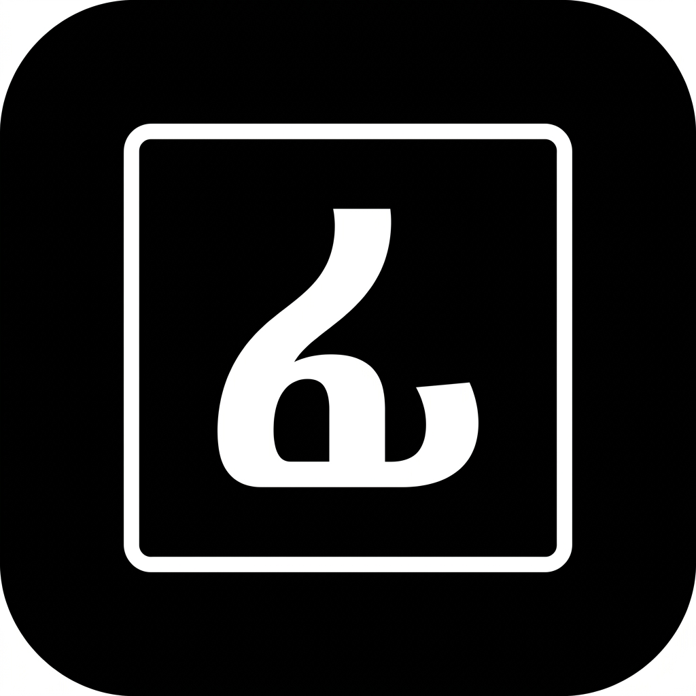
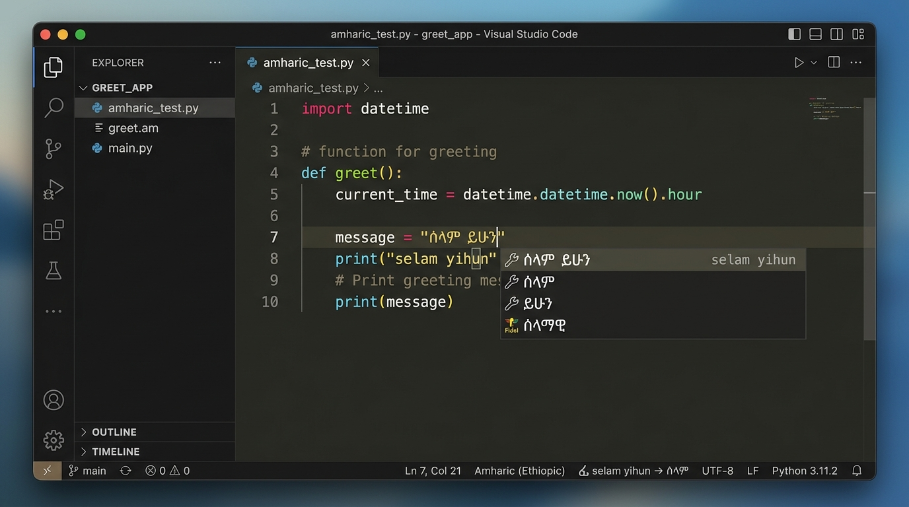

# Fidel Input (ፊደል)

<p align="center">
  
</p>

<p align="center">
  <strong>Fast, real-time Amharic phonetic input and Ethiopic transliteration engine for Visual Studio Code.</strong>
</p>

<p align="center">
  <a href="#quick-start">Quick Start</a> &bull;
  <a href="#keyboard-shortcuts--commands">Shortcuts</a> &bull
  <a href="#feature-guide--how-it-works">Feature Guide</a> &bull;
  <a href="#phonetic-mapping-reference">Phonetic Reference</a> &bull;
  <a href="#configuration">Configuration</a> &bull;
  <a href="#author--credits">Credits</a> &bull;
  <a href="#license">License</a>
</p>

---

## Overview

**Fidel Input** is a native Visual Studio Code extension designed for inputting Amharic text using a standard QWERTY keyboard. Rather than performing static string conversions, Fidel operates as a live **Input Method Editor (IME)**. It intercepts typing inside active editors, maintains an uncommitted composition buffer, and replaces characters dynamically as phonetic syllables are constructed.

---

## Visual Demonstration & Media

<p align="center">
  
</p>

<p align="center">
  <video src="https://github.com/hailemichael121/fidel-input/raw/HEAD/media/demo.mp4" controls="controls" width="100%" autoplay loop muted>
    Your browser does not support HTML5 video streaming.
  </video>
</p>

---

## Quick Start

1. Install the **Fidel Input** extension in Visual Studio Code.
2. Press **`Ctrl + Alt + A`** (or **`Cmd + Alt + A`** on macOS) to enable Amharic input mode.
3. Type phonetic Amharic:
   ```text
   selam yihun
   ->
   ሰላም ይሁን
   ```
4. Highlight any existing Latin text and press **`Ctrl + Alt + F`** (or **`Cmd + Alt + F`** on macOS) to convert the selection directly into Ethiopic script.

---

## Keyboard Shortcuts & Commands

| Command | Shortcut (Windows/Linux) | Shortcut (macOS) | Context | Description |
| :--- | :--- | :--- | :--- | :--- |
| `fidel.toggleInput` | **`Ctrl + Alt + A`** | **`Cmd + Alt + A`** | Editor Text Focus | Toggles Fidel Amharic input mode on or off |
| `fidel.convertSelection` | **`Ctrl + Alt + F`** | **`Cmd + Alt + F`** | Has Selection | Transliterates selected Latin text to Ethiopic script |
| `fidel.restartEngine` | Title Bar / Palette | Title Bar / Palette | Global | Re-initializes Fidel engine and clears composition buffer |
| `fidel.resetComposition` | Command Palette | Command Palette | Active Editor | Instantly resets uncommitted composition buffer |
| `fidel.disableInput` | **`Escape`** | **`Escape`** | Fidel Input Active | Disables Fidel input mode instantly |
| `fidel.enableInput` | Command Palette | Command Palette | Global | Enables Fidel Amharic input mode |

---

## Feature Guide & How It Works

### 1. Live Composition Buffer Engine

Fidel intercepts keystrokes continuously, calculating phonetic syllable matches and modifying the document transactionally without forcing manual backspacing.

```text
User types:   s   ->   e   ->   l   ->   a   ->   m   ->   SPACE
Buffer:      "s"      "se"     "sel"   "sela"   "selam"    ""
Rendered:    "ስ"      "ሰ"      "ሰል"    "ሰላ"     "ሰላም"     "ሰላም "
```

### 2. Automatic Word Boundary & Punctuation Commits

Composition buffers commit automatically upon hitting whitespace or punctuation delimiters (`.`, `,`, `!`, `?`, `;`, `:`). When `fidel.convertPunctuation` is enabled, Latin punctuation marks convert into Ethiopic punctuation equivalents:

* `selam,` -> `ሰላም፤`
* `yihun.` -> `ይሁን።`
* `bet?` -> `ቤት፧`

### 3. Ethiopic Numeral System (`fidel.convertNumbers`)

When `"fidel.convertNumbers": true` is enabled in settings, Arabic digits convert into traditional additive Ethiopic numerals:

* Single Digits: `1` -> `፩`, `5` -> `፭`, `9` -> `፱`
* Tens: `10` -> `፲`, `12` -> `፲፪`, `25` -> `፳፭`
* Hundreds & Thousands: `100` -> `፻`, `200` -> `፪፻`, `2026` -> `፳፻፳፮`

### 4. Glottal Stop & Ejective Apostrophe Parsing

Amharic ejectives and glottalized roots are typed using a trailing apostrophe (`'`) or SERA uppercase triggers:

* `k'a` -> **ቃ**
* `t'a` -> **ጣ** (or `Ta` -> **ጣ**)
* `c'a` -> **ጫ** (or `CHa` -> **ጫ**)
* `p'e` -> **ጰ** (or `Pe` -> **ጰ**)
* `p'a` -> **ጳ** (or `Pa` -> **ጳ**)

### 5. Smart Phonetic Correction (`fidel.smartCorrection`)

When `"fidel.smartCorrection": true` is enabled (default), Fidel automatically normalizes double-consonant typing variants and English digraph typos:

* Double trailing consonants: `selamm` -> `ሰላም`, `yihunn` -> `ይሁን`
* Double internal vowels/consonants: `beett` -> `ቤት`
* Digraph substitutions: `amhariph` -> `አማሪፍ`

### 6. Homophone Candidate Suggestions (`fidel.suggestions`)

Fidel offers two UI models for inspecting and choosing homophone candidates (e.g. `haile` -> `ሀይለ`, `ኃይለ`, `ሐይለ`):

* **IntelliSense Suggestion Box Below Text Cursor**: When `"fidel.suggestions": true` is enabled in settings, VS Code displays an IntelliSense candidate list directly beneath your active typing cursor as you type.
* **Interactive QuickPick Command Palette**: Select any word or place your cursor on a word and run command `Fidel: Show Homophone Candidate Suggestions` (`fidel.showSuggestions`) to inspect and select homophone variants.

### 7. On-Demand Selection Conversion (`Ctrl + Alt + F`)

Highlight any Latin block of text in your editor and press **`Ctrl + Alt + F`** (or **`Cmd + Alt + F`** on macOS) to instantly convert it to Ethiopic script without enabling full live input mode.

### 8. Atomic Undo / Redo Edit Stack

Typing a word creates an atomic edit session. Pressing **`Ctrl + Z`** (Undo) after typing a word reverts the entire word composition at once, rather than stepping backward letter-by-letter.

---

## Phonetic Mapping Reference

### 1. Order Summary Matrix

| Order | Vowel Suffix | Example Input | `s` Family Output |
| :--- | :--- | :--- | :--- |
| **1st Order (ግዕዝ)** | `a` | `sa` | **ሰ** |
| **2nd Order (ካዕብ)** | `u` | `su` | **ሱ** |
| **3rd Order (ሣልስ)** | `i` | `si` | **ሲ** |
| **4th Order (ራብዕ)** | `aa` | `saa` | **ሳ** |
| **5th Order (ኃምስ)** | `e` / `ee` | `se` / `see` | **ሴ** |
| **6th Order (ሳድስ)** | Bare consonant | `s` | **ስ** |
| **7th Order (ሣብዕ)** | `o` | `so` | **ሶ** |
| **8th Order (ዲቃላ)** | `wa` / `oa` | `swa` | **ሷ** |

---

### 2. Complete Ethiopic Syllabary Table (33 Families & Compounds)

Below is the complete reference table of all 33 Ethiopic consonant families, standalone vowels, and labialized compound forms (ዲቃላ) with their English phonetic inputs and alternative trigger variants:

| Family | Phonetic Triggers / Variants | 1st Order (`a`) | 2nd Order (`u`) | 3rd Order (`i`) | 4th Order (`aa`) | 5th Order (`e`/`ee`) | 6th Order (bare) | 7th Order (`o`) | 8th Order Labialized (`wa`/`oa`) |
| :--- | :--- | :---: | :---: | :---: | :---: | :---: | :---: | :---: | :---: |
| **Ha (ሀ)** | `h` | **ሀ** (`he`) | **ሁ** (`hu`) | **ሂ** (`hi`) | **ሃ** (`ha`) | **ሄ** (`hee`) | **ህ** (`h`) | **ሆ** (`ho`) | **ኋ** (`hwa`) |
| **La (ለ)** | `l` | **ለ** (`le`) | **ሉ** (`lu`) | **ሊ** (`li`) | **ላ** (`la`) | **ሌ** (`lee`) | **ል** (`l`) | **ሎ** (`lo`) | **ሏ** (`lwa`) |
| **HHa (ሐ)** | `H`, `hh` | **ሐ** (`He`) | **ሑ** (`Hu`) | **ሒ** (`Hi`) | **ሓ** (`Ha`) | **ሔ** (`Hee`) | **ሕ** (`H`) | **ሖ** (`Ho`) | **ሗ** (`Hwa`) |
| **Ma (መ)** | `m` | **መ** (`me`) | **ሙ** (`mu`) | **ሚ** (`mi`) | **ማ** (`ma`) | **ሜ** (`mee`) | **ም** (`m`) | **ሞ** (`mo`) | **ሟ** (`mwa`) |
| **SSa (ሠ)** | `ss` | **ሠ** (`sse`) | **ሡ** (`ssu`) | **ሢ** (`ssi`) | **ሣ** (`ssa`) | **ሤ** (`ssee`) | **ሥ** (`ss`) | **ሦ** (`sso`) | **ሧ** (`sswa`) |
| **Ra (ረ)** | `r` | **ረ** (`re`) | **ሩ** (`ru`) | **ሪ** (`ri`) | **ራ** (`ra`) | **ሬ** (`ree`) | **ር** (`r`) | **ሮ** (`ro`) | **ሯ** (`rwa`) |
| **Sa (ሰ)** | `s` | **ሰ** (`se`) | **ሱ** (`su`) | **ሲ** (`si`) | **ሳ** (`sa`) | **ሴ** (`see`) | **ስ** (`s`) | **ሶ** (`so`) | **ሷ** (`swa`) |
| **Sha (ሸ)** | `sh`, `Sh` | **ሸ** (`she`) | **ሹ** (`shu`) | **ሺ** (`shi`) | **ሻ** (`sha`) | **ሼ** (`shee`) | **ሽ** (`sh`) | **ሾ** (`sho`) | **ሿ** (`shwa`) |
| **Qa (ቀ)** | `q`, `k'` | **ቀ** (`qe`) | **ቁ** (`qu`) | **ቂ** (`qi`) | **ቃ** (`qa`) | **ቄ** (`qee`) | **ቅ** (`q`) | **ቆ** (`qo`) | **ቋ** (`qwa`) |
| **Ba (በ)** | `b` | **በ** (`be`) | **ቡ** (`bu`) | **ቢ** (`bi`) | **ባ** (`ba`) | **ቤ** (`bee`) | **ብ** (`b`) | **ቦ** (`bo`) | **ቧ** (`bwa`) |
| **Va (ቨ)** | `v` | **ቨ** (`ve`) | **ቨ** (`vu`) | **ቪ** (`vi`) | **ቫ** (`va`) | **ቬ** (`vee`) | **ቭ** (`v`) | **ቮ** (`vo`) | **ቯ** (`vwa`) |
| **Ta (ተ)** | `t` | **ተ** (`te`) | **ቱ** (`tu`) | **ቲ** (`ti`) | **ታ** (`ta`) | **ቴ** (`tee`) | **ት** (`t`) | **ቶ** (`to`) | **ቷ** (`twa`) |
| **Cha (ቸ)** | `ch`, `c` | **ቸ** (`che`) | **ቹ** (`chu`) | **ቺ** (`chi`) | **ቻ** (`cha`) | **ቼ** (`chee`) | **ች** (`ch`) | **ቾ** (`cho`) | **ቿ** (`chwa`) |
| **H'a (ኀ)** | `h'` | **ኀ** (`h'e`) | **ኁ** (`h'u`) | **ኂ** (`h'i`) | **ኃ** (`h'a`) | **ኄ** (`h'ee`) | **ኅ** (`h'`) | **ኆ** (`h'o`) | **ኋ** (`h'wa`) |
| **Na (ነ)** | `n` | **ነ** (`ne`) | **ኑ** (`nu`) | **ኒ** (`ni`) | **ና** (`na`) | **ኔ** (`nee`) | **ን** (`n`) | **ኖ** (`no`) | **ኗ** (`nwa`) |
| **Nya (ኘ)** | `ny`, `GN`, `N` | **ኘ** (`nye`) | **ኙ** (`nyu`) | **ኚ** (`nyi`) | **ኛ** (`nya`) | **ጜ** (`nyee`) | **ኝ** (`ny`) | **ኞ** (`nyo`) | **፝** (`nywa`) |
| **A (አ - Standalone)** | `a` | **አ** (`a`) | **ኡ** (`u`) | **ኢ** (`i`) | **ኣ** (`aa`) | **ኤ** (`ee`) | **እ** (`e`) | **ኦ** (`o`) | **ኧ** (`wa`) |
| **E (እ - Standalone)** | `e` | **እ** (`e`) | **ኡ** (`u`) | **ኢ** (`i`) | **አ** (`a`) | **ኤ** (`ee`) | **እ** (`e`) | **ኦ** (`o`) | — |
| **I (ኢ - Standalone)** | `i` | **ኢ** (`i`) | **ኡ** (`u`) | **ኢ** (`i`) | **ኢያ** (`ia`) | **ኤ** (`ee`) | **ኢ** (`i`) | **ኦ** (`o`) | — |
| **U (ኡ - Standalone)** | `u` | **ኡ** (`u`) | **ኡ** (`u`) | **ኢ** (`i`) | **ኡኣ** (`ua`) | **ኤ** (`ee`) | **ኡ** (`u`) | **ኦ** (`o`) | — |
| **O (ኦ - Standalone)** | `o` | **ኦ** (`o`) | **ኡ** (`u`) | **ኢ** (`i`) | **ኦኣ** (`oa`) | **ኤ** (`ee`) | **ኦ** (`o`) | **ኦ** (`o`) | — |
| **Ka (ከ)** | `k` | **ከ** (`ke`) | **ኩ** (`ku`) | **ኪ** (`ki`) | **ካ** (`ka`) | **ኬ** (`kee`) | **ክ** (`k`) | **ኮ** (`ko`) | **ኳ** (`kwa`) |
| **KHa (ኸ)** | `kh` | **ኸ** (`khe`) | **ኹ** (`khu`) | **ኺ** (`khi`) | **ኻ** (`kha`) | **ኼ** (`khee`) | **ኽ** (`kh`) | **ኾ** (`kho`) | **ዃ** (`khwa`) |
| **Wa (ወ)** | `w` | **ወ** (`we`) | **ዉ** (`wu`) | **ዊ** (`wi`) | **ዋ** (`wa`) | **ዌ** (`wee`) | **ው** (`w`) | **ዎ** (`wo`) | — |
| **AHa (ዐ)** | `ah`, `A` | **ዐ** (`ahe`) | **ዑ** (`ahu`) | **ዒ** (`ahi`) | **ዓ** (`aha`) | **ዔ** (`ahee`) | **ዕ** (`ah`) | **ዖ** (`aho`) | — |
| **Za (ዘ)** | `z` | **ዘ** (`ze`) | **ዙ** (`zu`) | **ዚ** (`zi`) | **ዛ** (`za`) | **ዜ** (`zee`) | **ዝ** (`z`) | **ዞ** (`zo`) | **ዟ** (`zwa`) |
| **ZHa (ዠ)** | `zh`, `Z` | **ዠ** (`zhe`) | **ዡ** (`zhu`) | **ዢ** (`zhi`) | **ዣ** (`zha`) | **ዤ** (`zhee`) | **ዥ** (`zh`) | **ዦ** (`zho`) | **ዧ** (`zhwa`) |
| **Ya (የ)** | `y` | **የ** (`ye`) | **ዩ** (`yu`) | **ይ** (`yi`) | **ያ** (`ya`) | **ዬ** (`yee`) | **ይ** (`y`) | **ዮ** (`yo`) | — |
| **Da (ደ)** | `d` | **ደ** (`de`) | **ዱ** (`du`) | **ዲ** (`di`) | **ዳ** (`da`) | **ዴ** (`dee`) | **ድ** (`d`) | **ዶ** (`do`) | **ዷ** (`dwa`) |
| **Ja (ጀ)** | `j` | **ጀ** (`je`) | **ጁ** (`ju`) | **ጂ** (`ji`) | **ጃ** (`ja`) | **ጄ** (`jee`) | **ጅ** (`j`) | **ጆ** (`jo`) | **ጇ** (`jwa`) |
| **Ga (ገ)** | `g` | **ገ** (`ge`) | **ጉ** (`gu`) | **ጊ** (`gi`) | **ጋ** (`ga`) | **ጌ** (`gee`) | **ግ** (`g`) | **ጎ** (`go`) | **ጓ** (`gwa`) |
| **T'a (ጠ)** | `t'`, `T` | **ጠ** (`t'e`) | **ጡ** (`t'u`) | **ጢ** (`t'i`) | **ጣ** (`t'a`) | **ጤ** (`t'ee`) | **ጥ** (`t'`) | **ጦ** (`t'o`) | **ጧ** (`t'wa`) |
| **C'a (ጨ)** | `c'`, `CH` | **ጨ** (`c'e`) | **ጩ** (`c'u`) | **ጪ** (`c'i`) | **ጫ** (`c'a`) | **ጬ** (`c'ee`) | **ጭ** (`c'`) | **ጮ** (`c'o`) | **ጯ** (`c'wa`) |
| **P'a (ጰ)** | `p'`, `P` | **ጰ** (`p'e`) | **ጱ** (`p'u`) | **ጲ** (`p'i`) | **ጳ** (`p'a`) | **ጴ** (`p'ee`) | **ጵ** (`p'`) | **ጶ** (`p'o`) | **ጷ** (`p'wa`) |
| **TSa (ጸ)** | `ts`, `Tz`, `S'` | **ጸ** (`tse`) | **ጹ** (`tsu`) | **ጺ** (`tsi`) | **ጻ** (`tsa`) | **ጼ** (`tsee`) | **ጽ** (`ts`) | **ጾ** (`tso`) | **ጿ** (`tswa`) |
| **TZa (ፀ)** | `tz` | **ፀ** (`tze`) | **ፁ** (`tzu`) | **ፂ** (`tzi`) | **ፃ** (`tza`) | **ፄ** (`tzee`) | **ፅ** (`tz`) | **ፆ** (`tzo`) | — |
| **Fa (ፈ)** | `f` | **ፈ** (`fe`) | **ፉ** (`fu`) | **ፊ** (`fi`) | **ፋ** (`fa`) | **ፌ** (`fee`) | **ፍ** (`f`) | **ፎ** (`fo`) | **ፏ** (`fwa`) |
| **Pa (ፐ)** | `p` | **ፐ** (`pe`) | **ፑ** (`pu`) | **ፒ** (`pi`) | **ፓ** (`pa`) | **ፔ** (`pee`) | **ፕ** (`p`) | **ፖ** (`po`) | **ፗ** (`pwa`) |

---

## Configuration

Extension settings can be configured in VS Code `settings.json`:

```json
{
  "fidel.enableByDefault": false,
  "fidel.convertPunctuation": true,
  "fidel.convertNumbers": true,
  "fidel.autoDisableOnEnter": false
}
```

---

## Development & Testing

Built with [Bun](https://bun.sh), TypeScript, and esbuild.

```bash
# Type check TypeScript files
bun run check

# Bundle extension code
bun run build

# Run unit and integration tests
bun test
```

---

## Author & Credits

**Fidel Input** is created, owned, and maintained by **Yihun Shekuri**.

* **Author**: Yihun Shekuri
* **GitHub Profile**: [@Hailemichael121](https://github.com/Hailemichael121)
* **Repository**: [Hailemichael121/fidel-input](https://github.com/Hailemichael121/fidel-input)

---

## License

This project is licensed under the [MIT License](LICENSE).

Copyright (c) 2026 Yihun Shekuri.
